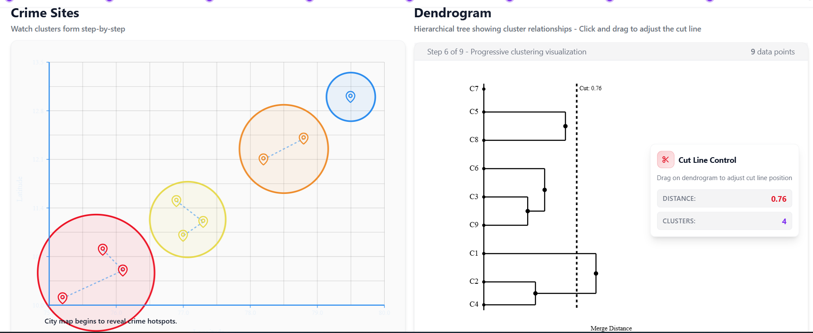
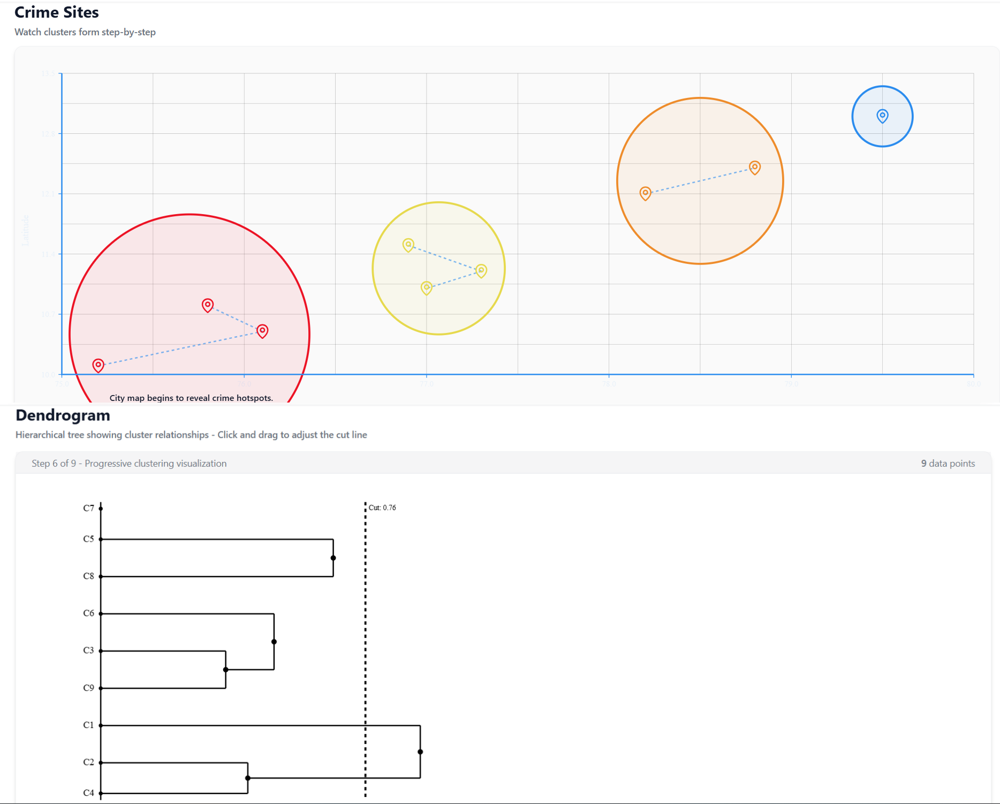
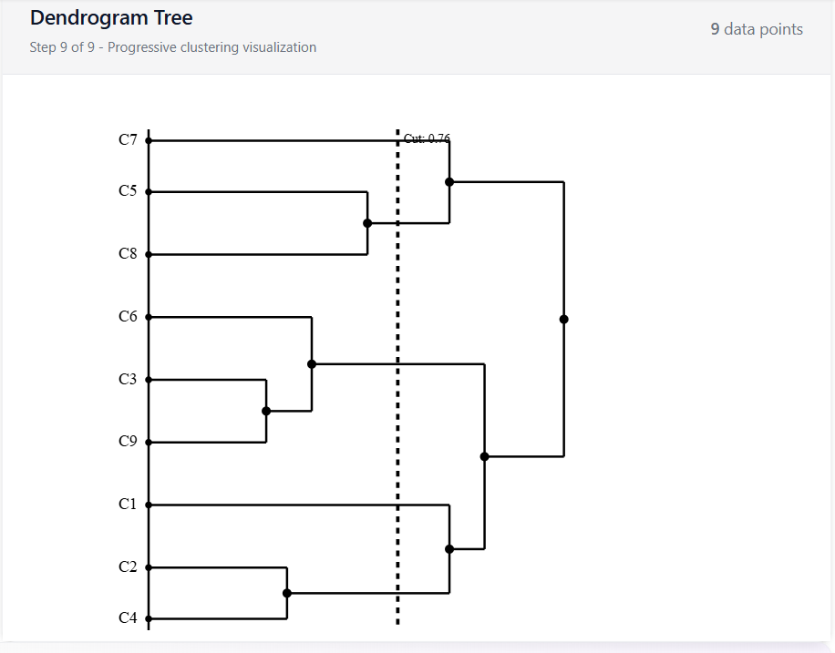

# Interactive Hierarchical Clustering Visualization

[](https://github.com/thokasanjayteja014-star/DHV-Project)

An interactive web application for visualizing hierarchical clustering algorithms with real-time dendrograms and scatter plots. This educational tool helps users understand clustering concepts through hands-on visualization and step-by-step animations.

**Repository**: [https://github.com/thokasanjayteja014-star/DHV-Project](https://github.com/thokasanjayteja014-star/DHV-Project)


## 📋 Table of Contents

- [Overview](#overview)
- [Features](#features)
- [Screenshots](#screenshots)
- [Tech Stack](#tech-stack)
- [Installation](#installation)
- [Usage](#usage)
- [Project Structure](#project-structure)
- [Datasets](#datasets)
- [Clustering Algorithms](#clustering-algorithms)
- [Customization](#customization)
- [Contributing](#contributing)
- [License](#license)

## 🎯 Overview

This application provides an intuitive way to understand hierarchical clustering algorithms through interactive visualizations. Users can:

- Explore different datasets (Medical Patients, Crime Sites, Customer Segmentation)
- Visualize clustering processes with real-time dendrograms and scatter plots
- Step through clustering algorithms step-by-step
- Adjust cluster counts using an interactive cut line
- Watch educational videos explaining clustering concepts
- View real-life examples of clustering applications

## ✨ Features

### 🎨 Interactive Visualizations

- **Dendrogram Tree**: Hierarchical tree structure showing cluster relationships with adjustable cut line
- **Scatter Plot**: 2D visualization of data points with cluster highlighting and unique color coding
- **Layout Options**: Switch between side-by-side and top-bottom layouts
- **Dynamic Updates**: Real-time recalculation on parameter changes

### 🔬 Clustering Algorithms

- **Agglomerative Clustering** (Bottom-up approach): Starts with individual points and merges them

- **Single Linkage Distance**: Uses minimum distance between clusters for merging

### 📊 Datasets

1. **Medical Patients Dataset**
   - Features: Age, Temperature, Blood Pressure, Sugar Level
   - Purpose: Identify health risk groups and patient clusters
   - Cluster Types: Normal/Stable, Mild Viral Infection, Metabolic Risk, Mixed Symptoms

2. **Crime Sites Dataset**
   - Features: Latitude, Longitude, Severity Level
   - Purpose: Geographic crime pattern analysis
   - Cluster Types: Geographic crime zones with severity levels

3. **Customer Segmentation Dataset**
   - Features: Age, Annual Income, Spending Score, Loyalty Years
   - Purpose: Customer behavior segmentation
   - Cluster Types: Different customer segments based on behavior

### 🎓 Educational Features

- **Video Explanation**: Animated video explaining hierarchical clustering in simple terms
- **Real-Life Examples**: Six practical examples of clustering applications
- **Step-by-Step Narrations**: Contextual explanations for each clustering step
- **Interactive Tooltips**: Hover over points and clusters for detailed information

### 🎛️ Interactive Controls

- **Dataset Selection**: Switch between different datasets
- **Algorithm Selection**: Choose between Agglomerative and Divisive clustering
- **Axis Selection**: Customize X and Y axes for different data views
- **Playback Controls**: Step forward/backward through clustering process
- **Cut Line Control**: Adjust cluster count dynamically
- **Layout Toggle**: Switch between side-by-side and top-bottom views

## 📸 Screenshots

### Home Page


*Landing page with explanation, video access, and real-life examples*

### Interactive Clustering Visualization


*Scatter plot and dendrogram displayed side by side*


*Scatter plot and dendrogram displayed in top-bottom layout*

### Video Modal


*Full-screen video explanation modal*

### Real-Life Examples


*Examples of clustering applications in various domains*

### Interactive Controls


*Control panel with dataset selection, algorithm options, and playback controls*

### Dendrogram Visualization


*Detailed view of the dendrogram with all data points clearly visible*

### Scatter Plot with Clusters


*Scatter plot showing clustered data points with unique colors*

---

**Note**: Please add your actual screenshots to the `screenshots/` directory. The images above are placeholders.

## 🚀 Tech Stack

- **Framework**: [Next.js 14](https://nextjs.org/) (App Router)
- **Language**: TypeScript
- **Styling**: [Tailwind CSS](https://tailwindcss.com/)
- **UI Components**: [Radix UI](https://www.radix-ui.com/) + [shadcn/ui](https://ui.shadcn.com/)
- **State Management**: React Hooks + [TanStack Query](https://tanstack.com/query)
- **Icons**: [Lucide React](https://lucide.dev/)
- **Animations**: [Framer Motion](https://www.framer.com/motion/)

## 🛠️ Installation

### Prerequisites

- Node.js 18.0 or higher
- npm or yarn package manager
- Git (for cloning the repository)

### Setup Instructions

1. **Clone the repository**
   ```bash
   git clone https://github.com/thokasanjayteja014-star/DHV-Project
   cd DHV-Project
   ```

2. **Install dependencies**
   ```bash
   npm install
   ```

3. **Run the development server**
   ```bash
   npm run dev
   ```

4. **Open your browser**
   Navigate to [http://localhost:3000](http://localhost:3000)

### Production Build

```bash
# Build for production
npm run build

# Start production server
npm start
```

## 📖 Usage

### Getting Started

1. **Landing Page**: Start at the home page to learn about hierarchical clustering
2. **Watch Video**: Click "Watch Video Explanation" to view the educational video
3. **Explore Examples**: Scroll down to see real-life clustering applications
4. **Start Visualization**: Click "Start Clustering Visualization" to begin

### Using the Clustering Visualization

1. **Select Dataset**: Choose from Medical Patients, Crime Sites, or Customer Segmentation
2. **Choose Algorithm**: Select Agglomerative or Divisive clustering
3. **Customize Axes**: Select different X and Y axes to view data from different perspectives
4. **Step Through Process**: Use the progress dots or navigation buttons to step through clustering
5. **Adjust Cut Line**: Drag the cut line in the dendrogram to change the number of clusters
6. **Switch Layout**: Use the layout toggle to switch between side-by-side and top-bottom views
7. **Add Points**: Click "Add Point" to add custom data points and see how they cluster

### Understanding the Visualizations

- **Scatter Plot**: Shows data points in 2D space. Points in the same cluster share the same color
- **Dendrogram**: Tree structure showing how clusters merge. Height represents merge distance
- **Cut Line**: Horizontal line in dendrogram. Points below the line are in the same cluster
- **Tooltips**: Hover over points or clusters to see detailed information

## 📁 Project Structure

```
DHV-Project/
├── app/
│   ├── api/
│   │   └── cluster/
│   │       └── route.ts          # Clustering API endpoint
│   ├── clustering/
│   │   └── page.tsx              # Clustering page route
│   ├── components/
│   │   ├── ui/                   # Reusable UI components (shadcn/ui)
│   │   ├── ClusterTooltip.tsx    # Cluster information tooltip
│   │   ├── ControlPanel.tsx      # Algorithm controls and settings
│   │   ├── DataPointTooltip.tsx  # Point information tooltip
│   │   ├── Dendrogram.tsx        # Dendrogram visualization component
│   │   ├── HierarchicalClusteringStory.tsx  # Story component
│   │   ├── RealLifeExamples.tsx  # Real-life examples component
│   │   ├── ScatterPlot.tsx       # Scatter plot visualization
│   │   ├── StoryDisplay.tsx      # Clustering story narration
│   │   ├── VideoModal.tsx        # Video modal component
│   │   ├── VideoPlayer.tsx       # Video player component
│   │   └── VideoPreview.tsx      # Video preview component
│   ├── hooks/
│   │   ├── use-mobile.tsx        # Mobile detection hook
│   │   └── use-toast.ts          # Toast notifications hook
│   ├── lib/
│   │   ├── clustering.ts         # Clustering algorithms implementation
│   │   ├── datasets.ts           # Dataset configurations
│   │   ├── queryClient.ts        # TanStack Query setup
│   │   └── utils.ts              # Utility functions
│   ├── App.tsx                   # Main app component
│   ├── ClusteringPage.tsx        # Main clustering page component
│   ├── globals.css               # Global styles
│   ├── layout.tsx                # Root layout
│   ├── not-found.tsx             # 404 page
│   └── page.tsx                  # Home page
├── attached_assets/              # Dataset CSV files
│   ├── medical_patients_dataset_*.csv
│   ├── crime_sites_clustering_dataset_*.csv
│   └── customer_segmentation_dataset_*.csv
├── docs/                         # Documentation files
│   ├── README.md
│   ├── srt-template.srt
│   
├── public/                       # Static assets
│   └── clustering-explained-simply.mp4  # Educational video
├── shared/
│   └── schema.ts                 # TypeScript interfaces and types
├── .gitignore                    # Git ignore rules
├── next-env.d.ts                 # Next.js TypeScript declarations
├── package.json                  # Dependencies and scripts
├── postcss.config.js             # PostCSS configuration
├── tailwind.config.ts            # Tailwind CSS configuration
├── tsconfig.json                 # TypeScript configuration
└── README.md                     # This file
```

## 📊 Datasets

### Medical Patients Dataset

- **Size**: 8 patients
- **Features**: 
  - Age (years)
  - Temperature (°F)
  - Blood Pressure (Systolic/Diastolic)
  - Sugar Level (mg/dL)
- **Purpose**: Identify health risk groups and patient clusters
- **Cluster Types**: 
  - Normal/Stable Group
  - Viral Infection Group
  - Cardiac & Metabolic Risk
  - Metabolic Risk Group
  - Elderly Hypertension
  - Healthy Baseline

### Crime Sites Dataset

- **Size**: 9 crime incidents
- **Features**: 
  - Latitude
  - Longitude
  - Crime Type
  - Severity Level
- **Purpose**: Geographic crime pattern analysis
- **Cluster Types**: Geographic crime zones with different severity levels

### Customer Segmentation Dataset

- **Size**: 9 customers
- **Features**: 
  - Age
  - Annual Income (k$)
  - Spending Score
  - Loyalty Years
- **Purpose**: Customer behavior segmentation
- **Cluster Types**: Different customer segments based on purchasing behavior and loyalty

## 🧮 Clustering Algorithms

### Single Linkage Distance

The application uses **single linkage (minimum distance)** for calculating cluster distances:

```
distance(C1, C2) = min { d(p1, p2) : p1 ∈ C1, p2 ∈ C2 }
```

This creates more intuitive hierarchical structures for visualization.

### Agglomerative Clustering

- **Approach**: Bottom-up
- **Process**: 
  1. Start with each point as its own cluster
  2. Find the two closest clusters
  3. Merge them into a new cluster
  4. Repeat until all points are in one cluster
- **Use Case**: Most common hierarchical clustering method

### Divisive Clustering

- **Approach**: Top-down
- **Process**: 
  1. Start with all points in one cluster
  2. Find the best way to split the cluster
  3. Recursively split clusters
  4. Continue until each point is its own cluster
- **Use Case**: Less common but useful for certain scenarios

### Dendrogram Construction

- Uses a `pointToNode` map to track hierarchical relationships
- Verifies cluster membership before merging
- Assigns actual merge distances as branch heights
- Implements fallback for incomplete trees
- Dynamic height calculation ensures all labels are visible

## 🎨 Customization

### Adding New Datasets

1. **Add CSV file** to `attached_assets/` directory
2. **Create dataset configuration** in `app/lib/datasets.ts`:

```typescript
export const yourDatasetConfig: DatasetConfig = {
  id: 'your-dataset',
  name: 'Your Dataset Name',
  icon: 'icon-name',
  xAxis: { label: 'X Label', key: 'x_column' },
  yAxis: { label: 'Y Label', key: 'y_column' },
  availableAxes: [
    { label: 'X Label', key: 'x_column', range: [min, max] },
    { label: 'Y Label', key: 'y_column', range: [min, max] },
  ],
  tooltipFields: [
    { label: 'Field 1', key: 'field1', format: (v) => `${v}` },
    { label: 'Field 2', key: 'field2', format: (v) => `${v}` },
  ],
  clusterColors: [
    'hsl(140, 65%, 50%)',  // Green
    'hsl(48, 90%, 55%)',   // Yellow
    'hsl(0, 75%, 55%)',    // Red
    'hsl(220, 75%, 60%)',  // Blue
  ],
  getDiagnosis: (stats) => {
    // Return cluster name based on statistics
    return 'Cluster Name';
  },
  getStoryStep: (step: number, algorithm: 'agglomerative' | 'divisive') => {
    // Return story narration for each step
    return 'Story text';
  },
};
```

3. **Add data array** and register in `DATASET_CONFIGS`

### Modifying Cluster Colors

Edit the `clusterColors` array in `app/lib/datasets.ts`:

```typescript
clusterColors: [
  'hsl(140, 65%, 50%)',  // Green
  'hsl(48, 90%, 55%)',   // Yellow
  'hsl(0, 75%, 55%)',    // Red
  'hsl(220, 75%, 60%)',  // Blue
],
```

### Customizing Cluster Names

Update the clustering logic in `getMedicalClusterName()`, `getCrimeClusterName()`, or `getCustomerClusterName()` functions in `app/lib/datasets.ts`.

## 📜 Available Scripts

```bash
# Development server with hot reload
npm run dev

# Build for production
npm run build

# Start production server
npm start

# Run TypeScript type checking
npm run check

# Run ESLint
npm run lint
```

## 🐛 Troubleshooting

### Port Already in Use

If port 3000 is occupied:
```bash
# Next.js will automatically try ports 3001, 3002, etc.
# Or specify a custom port:
PORT=3001 npm run dev
```

### Build Errors

Clear the build cache:
```bash
rm -rf .next
npm run build
```

### Module Not Found Errors

Reinstall dependencies:
```bash
rm -rf node_modules package-lock.json
npm install
```

## 🤝 Contributing

Contributions are welcome! Please follow these steps:

1. Fork the repository
2. Create a feature branch (`git checkout -b feature/amazing-feature`)
3. Commit your changes (`git commit -m 'Add some amazing feature'`)
4. Push to the branch (`git push origin feature/amazing-feature`)
5. Open a Pull Request

### Development Guidelines

- Follow TypeScript best practices
- Use meaningful variable and function names
- Add comments for complex logic
- Ensure responsive design for mobile devices
- Test with different datasets

## 📄 License

This project is licensed under the MIT License - see the LICENSE file for details.

## 🙏 Acknowledgments

- Built with [Next.js](https://nextjs.org/)
- UI components from [shadcn/ui](https://ui.shadcn.com/)
- Icons from [Lucide](https://lucide.dev/)
- Styling with [Tailwind CSS](https://tailwindcss.com/)
- State management with [TanStack Query](https://tanstack.com/query)

## 📞 Support

For issues and questions:

1. Check the documentation above
2. Review the code comments
3. Open an issue in the [repository](https://github.com/thokasanjayteja014-star/DHV-Project/issues)
4. Check existing issues for solutions

## 🔗 Links

- **Repository**: [GitHub - DHV-Project](https://github.com/thokasanjayteja014-star/DHV-Project)
- [Next.js Documentation](https://nextjs.org/docs)
- [Tailwind CSS Documentation](https://tailwindcss.com/docs)
- [shadcn/ui Documentation](https://ui.shadcn.com/)
- [TanStack Query Documentation](https://tanstack.com/query/latest)

---

**Built with ❤️ using Next.js and Tailwind CSS**

*Last updated: 2024*
